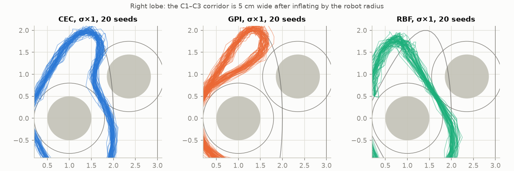
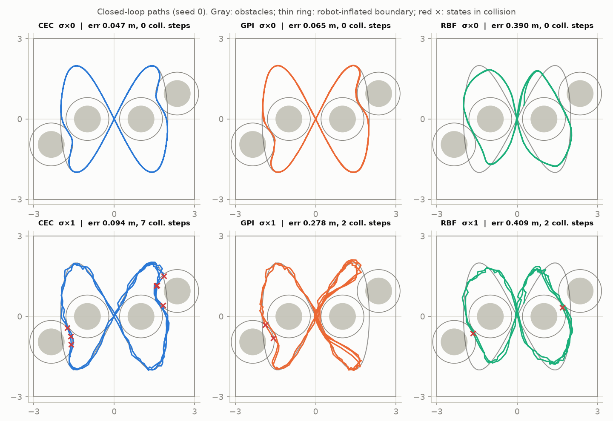
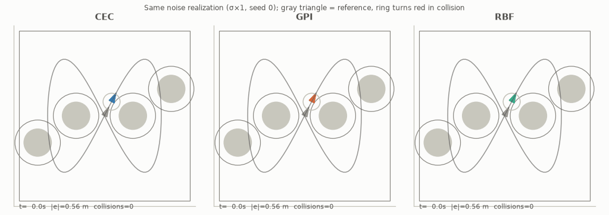
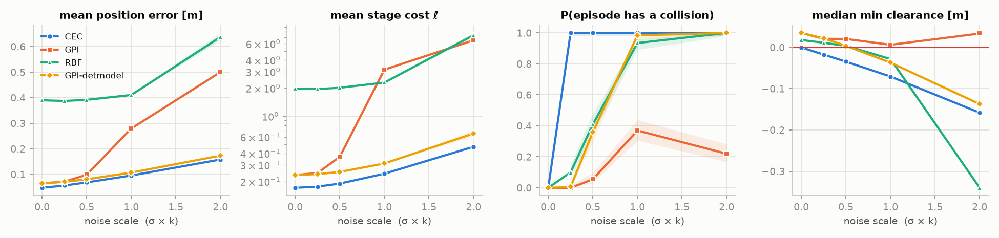
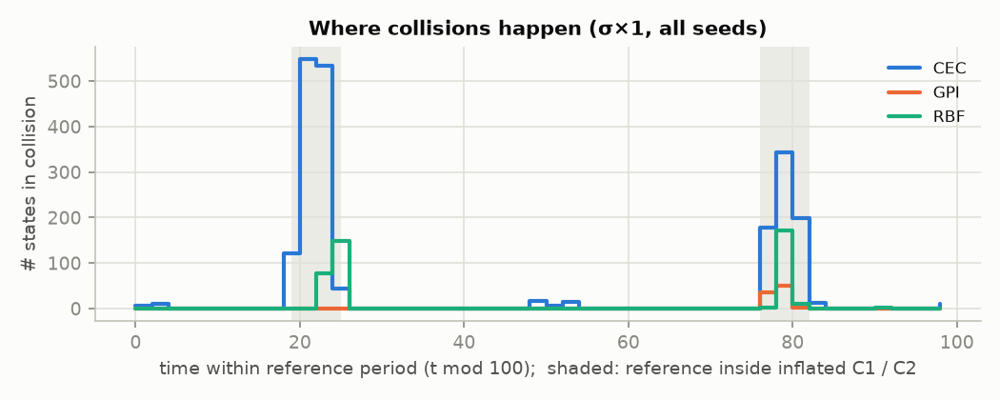
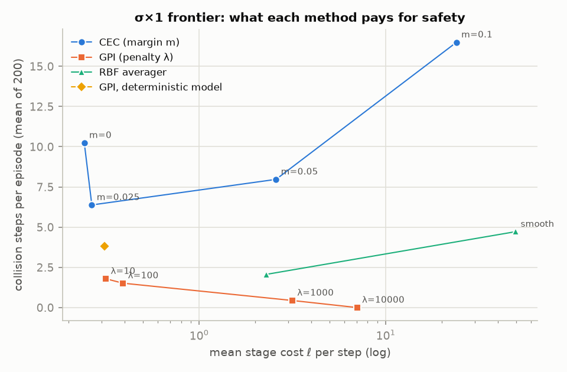
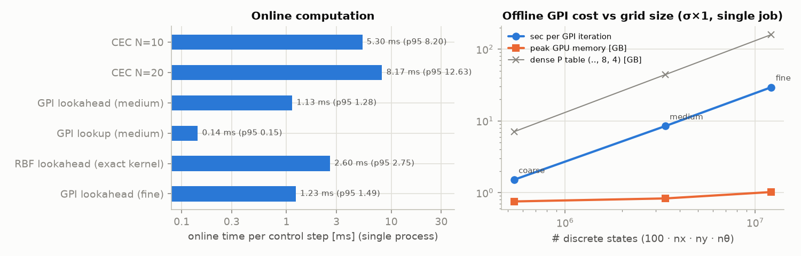
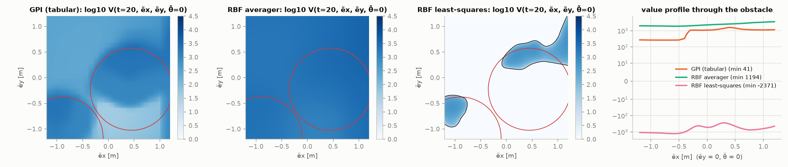

# CEC vs Tabular GPI vs RBF GPI — 가설 검증 리포트

ECE276B PR3(무한 지평 확률적 최적제어, differential-drive 궤적 추종)를 starter code에서 다시 구현했다. 그 위에서 사전에 세운 가설 5개를 **같은 simulator, 같은 cost, 같은 noise seed(common random numbers)** 조건으로 검증한 기록이다. 모든 수치는 원자료에서 다시 계산해 독립 검증 에이전트 5개가 교차 확인했다.

- 코드: [`starter_code/`](starter_code/) · 집계: [`summary.json`](starter_code/results/summary.json), [`extra_stats.json`](starter_code/results/extra_stats.json) · 그림: [`starter_code/results/figs/`](starter_code/results/figs/)
- 환경: conda env `traj`, Python 3.11, torch 2.14 (CUDA, L40S), CasADi 3.8 / IPOPT

---

## 0. 한눈에 보는 결론

| 가설 | 판정 | 핵심 근거 (k > 0은 200 paired seeds, σ×k는 noise 배율) |
|---|---|---|
| **H1** noise가 없으면 CEC의 추종 오차가 가장 작다 | **지지** (단서 있음) | σ×0 평균 위치오차: CEC 0.047 < GPI 0.065 < RBF 0.390 m. 단, CEC는 샘플 시점 clearance가 정확히 0이고, **식 (1)의 실제 연속 경로(원호)에서는 1.7 cm 침투**한다. GPI는 연속 경로에서도 +0.8 cm로 안전하다 |
| **H2** noise가 커질수록 CEC의 nominal safety가 약해진다 | **지지. 예상보다 훨씬 강함** | "점점 약해지는" 것이 아니다. **가장 작은 noise(σ×0.25)에서 이미 모든 episode가 충돌**했다(100%, 95% CI [0.98, 1.00]). noise에 따라 커지는 것은 침투 깊이다(중앙값 −1.7 → −3.4 → −7.1 → −15.8 cm). 충돌 시작 직전 계획은 96–100%에서 다음 상태를 clearance ≥ 0으로 예측했고, 대부분 여유 없이 경계에 붙어 있었다 |
| **H3** noisy rollout의 기대 누적 cost에서 GPI와 CEC의 격차가 줄어든다 | **문장 그대로는 기각. 메커니즘도 재정의** | tracking cost 격차는 **벌어진다**(할인 누적 cost 비 1.2× → 8.7×, 평균 stage cost 비 1.4× → 13.8×). 대신 충돌은 GPI가 압도적으로 적다(σ×0.25에서 0% vs 100%, σ×1에서 37% vs 100%). 2×2 ablation 결과, GPI의 안전을 만드는 것은 가설이 말한 **Bellman 전이의 Gaussian noise가 아니라 참 σ로 보정된 충돌확률 항**이었다 |
| **H4** online 제어시간은 GPI ≪ CEC, offline 비용은 grid와 함께 커진다 | **지지** (실용적 단서 있음) | online: GPI lookahead 1.13 ms(CEC의 4.7× 빠름), 순수 lookup 0.14 ms(37×), CEC 5.30 ms. offline: 한 iteration에 1.5 → 8.5 → 29.5 s로 상태 수에 거의 선형. 단, 모두 제어주기 500 ms보다 20× 이상 빠르고, 가장 빠른 순수 lookup은 통로 안에서 **안전하지 않다** |
| **H5** RBF는 메모리를 줄이지만 장애물 경계 근처에서 안전성이 나빠진다 | **지지** (메커니즘은 더 넓음) | 7.5× 압축된 averager-RBF는 k > 0 모든 수준에서 tabular보다 위험하다(σ×0.5에서 41% vs 5.5%). 편향은 경계만의 문제가 아니라 **전역적**이다(장애물과 먼 구간 오차 0.33 m vs 0.015 m). 일반 LS-RBF는 수렴은 했지만 **음의 값으로 크게 치우친 fixed point**로 갔다 |

**가설에 없던 구조적 발견.** robot 반경만큼 부풀린 장애물 C1–C3 사이, C2–C4 사이 통로의 폭이 **5 cm**밖에 안 되고, reference 자체가 부풀린 C1/C2 **안쪽을 지나간다**. 결과는 두 가지 층위로 설명된다.

1. **통로 안에서의 여유.** σ×0.25–0.5에서는 GPI도 CEC와 똑같이 매번 통로를 지난다. 그런데도 충돌이 0–5.5% vs 100%로 갈린다. CEC의 해는 clearance 0인 활성 제약 위에 붙고, GPI는 보정된 risk 항 때문에 약 2 cm 여유를 둔다.
2. **Homotopy 선택.** σ×1 이상에서는 GPI가 통로 대신 큰 우회를 택하고, 이것이 tracking cost 격차를 만든다. CEC는 margin을 넣어 통로를 막아도 우회로 넘어가지 못했다(N = 10, 단일 warm start 조건).

---

## 1. 문제와 구현 요약

### 1.1 공통 설정 (모든 방법에서 동일)
- 동역학: PDF 식 (1)의 exact discretization(sinc)을 쓴다. starter의 Euler가 아니다. Noise는 w ~ N(0, diag(σ·k)²), σ = [0.04, 0.04, 0.004], k ∈ {0, 0.25, 0.5, 1, 2}.
- Cost: Q = 10·I₂, q = 10, R = 0.1·I₂, γ = 0.95.
- 충돌: 장애물 반경 0.5와 robot 반경 0.3을 더해 **중심 간 거리 < 0.8**이면 충돌. workspace [−3, 3]² 밖은 별도 위반(oob)으로 센다. 문제 정의대로 **샘플 시점**에서 판정하고, 연속 경로 기준은 보조 지표로 따로 보고한다(§3).
- Episode: x₀ = lemniscate(2), 240 steps(120 s), 초기 위치오차 0.557 m. seed s의 표준정규 난수열 Z_s를 모든 controller와 모든 k가 공유한다(w = σ·k·Z_s). 비교는 전부 paired다.

### 1.2 CEC (`cec.py`)
- Horizon N = 10, multiple shooting. NLP는 한 번만 빌드하고 현재 상태와 reference window를 parameter로 넣는다.
- 장애물 제약 ‖p_k − c_i‖² + S_ik ≥ 0.8²(k = 1..N)에 slack S ≥ 0과 L1 exact penalty(ρ = 1e4)를 붙였다. ρ가 최적 multiplier보다 크면 feasible한 경우 hard constraint와 같다.
- Terminal cost γ^N · 5 · ℓ_state(e_N). Warm start는 shift한 이전 해에 heading 연속성을 보정해서 넣는다.
- σ×0에서 N = 5/10/15/25를 비교했다. 평균 위치오차는 0.0480/0.0474/0.0474/0.0474 m이고, N = 10 대비 최대 위치 차는 2.6/0.09/2.6 cm다. Solver 실패는 0%, slack 활성 비율은 σ×0–1에서 0–0.3%, σ×2에서 1.2%다.

### 1.3 Tabular GPI (`gpi.py`, `value_function.py`, GPU)
- 상태 grid: t 100개 × ẽx, ẽy 각 29개(적응형: [−0.8, 0.8]은 0.1 m 간격, 바깥은 1.0/1.25/1.6/2.0/2.5/3.0) × θ̃ 40개 = **3.36 M 상태**. 제어는 v 10개 × ω 11개 = 110개.
- 전이: 평균 g(t, e, u, 0)에 3-point Gauss–Hermite noise quadrature(27 노드)를 쓰고, 각 노드는 multilinear interpolation으로 8개 꼭짓점에 확률을 나눈다. 확률 합이 1인 정식 MDP로, PDF의 (…, 8, 4) 전이표와 같은 역할이다. 실제 지지 집합은 (state, action)당 중앙값 24개 노드다. 표는 **저장하지 않고 GPU에서 on-the-fly로 계산**한다. PDF 형식으로만 저장해도 medium 44 GiB, fine 159 GiB가 필요하다(하한).
- 충돌: stage cost에 λ·P_risk(t, e, u)를 더한다(λ = 1000). P_risk는 **다음 상태의 연속 위치**에서 half-plane 근사로 계산한 Φ(−clearance/σ_risk)다. σ_risk = max(σ_xy·k, 1 cm).
- Modified policy iteration: improvement 1회 + evaluation 10회를 한 iteration으로, 최대 20 iteration 돌린다. 모든 tabular 모델의 최종 policy 변화는 < 1e-4다.
- Online: 연속 상태에서 1-step lookahead argmin_u ℓ + γ E[V]를 계산한다(기본). 순수 table lookup π(t, 최근접 노드)도 비교했다.

### 1.4 RBF GPI (Part 3)
- 특징: grid-index 좌표(t와 θ는 주기적)에서 t는 stride 1, ẽx·ẽy·θ̃는 stride 2인 격자(100×15×15×20)에 Gaussian kernel을 둔다. **450 k 파라미터**, tabular 대비 7.5× 압축이다. 중심이 격자이므로 설계행렬이 Kronecker 곱이고, 차원별 eigen 분해로 **정확한 ridge LS**를 수 ms 안에 풀 수 있다.
- **LS-RBF(원래 설계)는 실패했다.** hat matrix에 음의 가중치가 있고 ‖Π‖∞ ≈ 10.9라 γ‖Π‖∞ > 1, 즉 sup-norm contraction이 보장되지 않는다. 반복 자체는 수렴했다(policy 변화 < 1e-4). 그러나 비용이 전부 ≥ 0인데도 V가 노드의 66–81%에서 음수인 fixed point로 갔다(σ×1, t = 0, e = 0에서 V = −1436, tabular는 +94.5). 원인은 greedy min이 fit이 과소추정된 지점을 골라 증폭하는 것이다. policy를 고정하고 평가만 하면 음수 노드가 11%에 그친다.
- **Averager-RBF(주 비교 대상)**: 행 합이 1인 정규화 RBF 특징과 averaging fit을 쓴다(Gordon 1995). 두 사상 모두 convex combination이라 γ-contraction이 보장되고 V ≥ 0이 유지된다. Kronecker 구조도 그대로다.
- Online: θᵀφ를 연속 상태에서 정확한 kernel 합으로 평가하고, 1-step lookahead로 제어를 고른다.

---

## 2. 구조적 발견: 5 cm 통로와 reference 안의 장애물

- reference가 부풀린 C1(t = 19–24)과 C2(t = 76–81) **안을 지난다**(최소 중심거리 0.413 < 0.8). reference를 완벽히 추종하면 충돌이다.
- 부풀린 C1–C3 통로 폭은 1.651 − 1.6 = **0.051 m**이고 C2–C4도 같다. C1 바깥쪽은 workspace 경계가 막는다(부풀린 C1이 x = 3.15까지). 출발점에서도 C3까지 clearance가 0.099 m다.
- σ_xy = 4 cm/step에서 통로의 가장 좁은 단면 중앙에 있는 한 샘플의 충돌확률은 약 51%다(Monte Carlo). 단면에서 10/20 cm 벗어나면 42%/21%로 줄고, 한 번 통과할 때 누적 충돌확률은 약 2/3다. **추종 성능과 안전이 이 통로에서 정면으로 충돌한다.**


*그림 1. σ×1에서 오른쪽 lobe의 20개 seed. CEC는 통로를 지나고, GPI는 C3 안쪽으로 우회한다. RBF는 통로를 지나되 reference에서 멀다.*


*그림 2. seed 0의 closed-loop 경로(위: σ×0, 아래: σ×1). 빨간 ×는 샘플 시점의 충돌 상태.*



---

## 3. 실험 프로토콜

- Noise 배율 k ∈ {0, 0.25, 0.5, 1, 2}. k > 0은 200 seeds, k = 0은 결정론적이라 1회뿐이다(CI 없음). GPI와 RBF는 **k별로 해당 noise model로 따로 학습**했다(주 실험 15개 모델, 전체 24개).
- 비교 controller:
  - **CEC**
  - **GPI**: tabular, 해당 k로 학습, lookahead
  - **GPI-lookup**: 순수 table lookup
  - **GPI-detmodel**: k = 0 모델을 noise 환경에서 평가
  - **RBF**: averager
  - **RBF-LS**: 실패 사례
- 지표:
  - 추종: 평균 위치/각 오차, 평균 stage cost, t = 0부터의 discounted cost
  - 안전: episode 충돌확률(Wilson 95% CI), 충돌 step 수, 최소 clearance
  - **연속 경로 충돌**: 식 (1)의 원호(한 step 동안 (v, ω) 일정)에 그 step의 noise를 선형으로 섞은 경로 기준. σ×0에서는 정확한 연속 궤적이다
  - 통로 사용률(reference의 통로 통과 5회 중 실제로 통로 중심선을 가로지른 비율. noise로 여러 번 가로지르면 100%를 넘을 수 있다)
  - online ms(단일 프로세스)
- 통계: 연속 지표는 paired Wilcoxon, 충돌 여부는 exact McNemar. 본문의 유의성 주장은 모두 이 검정의 결과이고, 유의하지 않은 비교는 p값과 함께 명시했다.
- 추가 실험:
  - (A) CEC 제약 tightening m ∈ {0, 2.5, 5, 10 cm}, σ×0.25와 σ×1
  - (B) GPI penalty λ ∈ {10, 100, 1000, 10000}, σ×1
  - (C) grid 크기 coarse/medium/fine, σ×1
  - (D) RBF 압축 48×, σ×1
  - (E) **2×2 ablation**(전이 noise on/off × risk σ 4 cm/1 cm), σ×1

---

## 4. 가설별 결과

### 주 결과표 (각 칸은 200 seed 평균, σ×0만 1회)

| σ×k | controller | 위치오차 [m] | stage cost | disc. cost | P(충돌) | 충돌 step | P(연속경로 충돌) | 통로 사용 |
|---|---|---|---|---|---|---|---|---|
| 0 | CEC | **0.047** | **0.171** | **6.86** | 0 | 0 | 1.00 | 100% |
| 0 | GPI | 0.065 | 0.235 | 8.12 | 0 | 0 | **0** | 100% |
| 0 | RBF | 0.390 | 1.98 | 46.9 | 0 | 0 | 1.00 | 100% |
| 0.25 | CEC | 0.056 | 0.176 | 6.94 | **1.00** | 8.17 | 1.00 | 100% |
| 0.25 | GPI | 0.071 | 0.246 | 8.46 | **0.00** | 0 | 0.30 | 100% |
| 0.25 | GPI-detmodel | 0.071 | 0.240 | 8.27 | 0.005 | 0.005 | 0.30 | 100% |
| 0.25 | GPI-lookup | 0.088 | 0.275 | 8.82 | 0.92 | 2.53 | 1.00 | 100% |
| 0.25 | RBF | 0.387 | 1.96 | 46.9 | 0.10 | 0.10 | 0.95 | 100% |
| 0.5 | CEC | 0.069 | 0.190 | 7.18 | 1.00 | 8.34 | 1.00 | 100% |
| 0.5 | GPI | 0.099 | 0.368 | 11.2 | **0.055** | 0.055 | 0.69 | 100% |
| 0.5 | GPI-detmodel | 0.081 | 0.253 | 8.48 | 0.36 | 0.40 | 0.88 | 100% |
| 0.5 | RBF | 0.392 | 2.02 | 47.9 | 0.41 | 0.51 | 0.98 | 100% |
| 1 | CEC | 0.096 | 0.242 | 8.11 | 1.00 | 10.24 | 1.00 | 100% |
| 1 | GPI | 0.280 | 3.16 | 70.6 | **0.37** | **0.44** | 0.78 | 40% |
| 1 | GPI-detmodel | 0.107 | 0.312 | 9.46 | 0.985 | 3.81 | 1.00 | 100% |
| 1 | GPI-lookup | 0.301 | 3.51 | 77.1 | 0.70 | 1.09 | 0.97 | 40% |
| 1 | RBF | 0.411 | 2.30 | 52.3 | 0.935 | 2.07 | 1.00 | 100% |
| 2 | CEC | 0.158 | 0.471 | 12.1 | 1.00 | 17.06 | 1.00 | 101% |
| 2 | GPI | 0.500 | 6.51 | 102 | **0.22** | **0.26** | 0.29 | 0% |
| 2 | GPI-detmodel | 0.173 | 0.654 | 15.6 | 1.00 | 11.93 | 1.00 | 100% |
| 2 | RBF | 0.638 | 7.38 | 102 | 1.00 | 8.31 | 1.00 | 91% |

RBF-LS는 모든 k에서 위치오차 2.0–2.3 m로 추종에 실패했다. 장애물 충돌은 0–6%로 적지만 workspace 이탈이 흔하다(σ×0 / 0.25 / 0.5 / 1 / 2에서 100 / 94.5 / 26.5 / 33 / 86.5%). 다른 controller의 이탈률은 0%다.


*그림 3. noise 배율별 위치오차, stage cost(log), 충돌확률(Wilson 95% CI), 최소 clearance. σ×0은 결정론적 1회라 구간이 없다.*

### H1 — noise가 없으면 CEC의 추종 오차가 가장 작다 → **지지 (단서 있음)**
- σ×0 위치오차는 CEC 0.047 < GPI 0.065(+38%) < GPI-lookup 0.085(+79%) < RBF 0.390 m이고, stage cost도 같은 순서다. NLP는 항상 잘 풀렸다.
- 38% 격차가 전부 grid 오차는 아니다. 약 절반은 부풀린 C1/C2를 도는 구간에서 GPI가 risk 항 때문에 경계에서 3.5 cm 떨어져 지나가는 데서 온다. 장애물과 먼 구간(t ≥ 20, reference clearance > 0.3 m)만 보면 오차는 CEC 0.6 cm, GPI 1.5 cm, lookup 3.7 cm, RBF 33 cm다.
- **단서.** CEC는 샘플 시점 clearance가 정확히 0.000이다(제약 경계에 붙어 있음). 식 (1)이 그리는 실제 연속 경로(원호)에서는 부풀린 C1/C2의 곡선 경계를 **1.7 cm** 잘라 들어간다. 직선 chord로 재면 3.5 cm로 과대평가되므로, 이 리포트는 원호 기준을 쓴다. σ×0 GPI는 샘플 clearance 3.5 cm, 원호 clearance +0.8 cm로 통로를 **연속 경로 기준으로도 안전하게** 지난다. "CEC가 가장 정확하다"는 이산시간 제약 정의 아래에서만 안전과 양립한다.

### H2 — noise가 커질수록 CEC의 nominal safety가 약해진다 → **지지. 더 강한 형태로 재정의**
- σ×0.25(σ_xy = 1 cm)에서 이미 **200/200 episode가 충돌**했고, k = 0.25–2 전 구간에서 P(충돌) = 1.00이다. nominal 최적해가 **활성 제약 위(clearance = 0)**에 놓이기 때문이다. 충돌 시작 직전 계획의 예측 clearance 중앙값은 σ×0.25에서 1.1 µm였다. 통로 구간에서 계획이 경계(|예측 clearance| < 1 mm)에 붙는 step은 episode당 12–15개이고, 그런 step의 다음 상태가 실제로 충돌하는 비율은 48–52%다. 대칭 noise에서 반반인 셈이다. 그래서 σ → 0이어도 충돌 **확률**은 0이 되지 않고 **깊이**만 0으로 간다.
- 침투 깊이는 σ에 거의 선형이다. 최소 clearance 중앙값은 −1.7 / −3.4 / −7.1 / −15.8 cm이고, 2 cm 넘게 침투한 episode 비율은 30 / 94 / 100 / 100%다.
- 충돌 시작 순간 계획이 다음 상태를 clearance ≥ 0으로 예측한 비율은 1057/1057, 1047/1057, 1239/1267, 1845/1920으로 96–100%다. 제약을 거의 hard로 지키는 NLP라서 이 비율은 구성상 높을 수밖에 없다. 더 직접적인 증거는 위의 "경계에 붙은 예측"이다(|예측| < 1 mm 비율 83 / 74 / 48 / 26%). 충돌은 통로 구간에 몰려 있다(그림 4).
- **Pilot A: 제약 tightening.**

| CEC margin m | σ×0.25: P(충돌) / 오차 | σ×1: P(충돌) / 충돌 step / 오차 | slack 사용 (σ×0.25 / σ×1) |
|---|---|---|---|
| 0 | 1.00 / 0.056 m | 1.00 / 10.2 / 0.096 m | 0% / 0.3% |
| 2.5 cm (≈ 통로 폭/2) | **0.13** / 0.060 m | 1.00 / 6.4 / 0.099 m | 0% / 0.4% |
| 5 cm (통로 infeasible) | 0.32 / 0.20 m | 1.00 / 8.0 / 0.23 m | 10% / 10% |
| 10 cm | 1.00 / **1.01 m** | 1.00 / 16.5 / 0.99 m | 38% / 32% |

  - margin이 충돌 **여부**를 줄이는 것은 noise가 아주 작을 때뿐이다. σ×0.25에서 m = 2.5 cm이면 0.13으로, 추종 비용 증가도 거의 없다.
  - m = 5 cm부터는 통로가 infeasible해진다. 이때 CEC는 slack을 써서 통로를 밀고 들어간다(통로 사용 100%, 오차 3.6×, stage cost 14×).
  - m = 10 cm에서는 통로 입구 근처에서 맴돌다가 reference가 돌아오면 waist를 가로질러 합류한다(평균 v 0.26 m/s, 오차 1 m, 통로 사용 11 / 27%). **좋은 우회 homotopy를 찾지 못한다.**
  - σ×1에서는 모든 m에서 P(충돌) = 1.00이고, m = 2.5 cm가 충돌 step만 10.2 → 6.4로 줄인다.
  - 모든 run은 N = 10이다. 우회를 못 찾는 원인이 horizon이 짧아서인지 solver가 local이라서인지는 분리하지 않았다(E5).


*그림 4. σ×1에서 충돌이 일어나는 시각(t mod 100). 음영은 reference가 부풀린 C1/C2 안에 있는 구간.*

### H3 — noisy rollout의 기대 누적 cost에서 GPI와 CEC의 격차가 줄어든다 → **문장 그대로는 기각. 안전과 메커니즘 측면에서 재정의**
1. **tracking cost 격차는 줄지 않고 벌어진다.**
   - 할인 누적 cost 비(GPI/CEC)는 1.18(σ×0) → 1.22 → 1.56 → **8.71**(σ×1) → 8.37(σ×2)이다. 평균 stage cost 비로는 1.37 → 1.40 → 1.94 → 13.0 → 13.8이다.
   - σ×0.5까지의 증가는 통로를 그대로 쓰면서 여유를 두는 비용이다. σ×1 이후의 급증은 통로를 포기하고 우회하는 비용이다(통로 사용 100% → 40% → 0%).
   - γ = 0.95에서는 처음 30 step이 가중치의 79%를 차지한다. 그래서 disc. cost 열은 초기 과도응답과 첫 오른쪽 lobe 통과를 주로 반영하고, 왼쪽 lobe(t ≈ 76, 가중치 0.02)는 거의 반영하지 않는다.
2. **안전을 포함하면 결론이 뒤집힌다.**
   - 충돌 episode는 σ×0.25 0% vs 100%, σ×0.5 5.5% vs 100%, σ×1 37% vs 100%, σ×2 22% vs 100%다(McNemar p ≤ 1e-30).
   - 충돌 1 step의 **손익분기 가격**은 GPI의 추가 비용 ÷ 줄인 충돌 step으로 정의했다. 비할인 episode 합 기준(평균 stage cost 차 × 240 ÷ 충돌 step 차)으로 2.1 / 5.2 / 71 / 86, 할인 기준으로 2.6 / 6.6 / 80 / 69다(σ×0.25 / 0.5 / 1 / 2). 충돌을 이보다 비싸게 매기면 GPI가 낫다. 문제 (3)은 p ∈ F를 hard constraint로 둔다.
3. **무엇이 안전을 만드나: 2×2 ablation(σ×1).**

| Bellman 전이의 noise | risk 항의 σ | P(충돌) | 충돌 step | 통로 사용 | stage cost |
|---|---|---|---|---|---|
| 있음(27 GH 노드) | 참값 4 cm | **0.37** | 0.44 | 40% | 3.16 |
| **없음**(결정론적) | 참값 4 cm | **0.41** | 0.48 | 40% | 3.27 |
| 있음 | 1 cm | 0.975 | 3.35 | 100% | 0.36 |
| 없음 (= GPI-detmodel) | 1 cm | 0.985 | 3.81 | 100% | 0.31 |

   - 전이 noise의 유무는 유의한 차이가 없다(37% vs 41%, McNemar p = 0.39; 97.5% vs 98.5%, p = 0.73). risk σ의 보정이 효과의 전부다(37% vs 97.5%, p = 2e-35).
   - 따라서 **GPI의 안전은 "Bellman 계산에 Gaussian transition을 넣었다"가 아니라, 참 σ로 보정된 1-step 충돌확률 항을 DP가 장기 비용으로 전파한 데서 나온다.**
   - 이유는 grid 간격(0.1 m)과 σ(4 cm)의 비율에 있다. 이 해상도에서 piecewise-linear value 위의 noise 평균은 보간값을 거의 바꾸지 않는다.
   - σ×0.25에서 GPI와 GPI-detmodel이 같았던 이유(0% vs 0.5%, p = 1.0)도 여기서 설명된다. detmodel의 risk σ 하한 1 cm가 참 σ_xy·0.25 = 1 cm와 같다.
4. **가설의 단서는 부분적으로 맞다.** GPI도 충돌이 0은 아니고(σ×1 37%), 연속 경로 기준 충돌은 σ×1에서 78%로 흔하다. coarse grid(0.54 M 상태)에서는 79%로 올라간다.
5. **비단조성과 lobe 비대칭.**
   - σ×2 GPI(22%)는 σ×1 GPI(37%)보다 충돌 episode가 적다(paired McNemar p = 0.001). 학습된 정책이 모든 seed에서 양쪽 lobe를 우회하기 때문이다(통로 사용 0%). 남은 충돌은 통로가 아니라 우회 경로와 출발점 근처에서 C3/C4에 닿으며 생기고, 5 cm 넘는 깊은 침투는 줄지 않았다(5.0% → 5.5%).
   - σ×1 GPI는 200 seed 전부에서 **오른쪽 lobe(C1–C3)는 우회, 왼쪽 lobe(C2–C4)는 통로 통과**를 택했다. 충돌은 모두 왼쪽 통로에서 났다. reference의 나머지 반쪽은 y축에 대한 거울상인데 C2는 C1의 점대칭 위치(y = −0.95)라서, 두 lobe에서 통로를 만나는 방향이 다르다(오른쪽은 lobe 끝 도달 전, 왼쪽은 끝을 지난 뒤).
   - 양쪽 통로를 다 쓰는 λ = 100 정책에서 통과 1회당 충돌 step은 오른쪽 0.33, 왼쪽 0.26이다. 양쪽 모두 우회하는 λ = 10000에서 우회 구간 비용은 오른쪽이 약간 더 컸다. 따라서 "오른쪽 통로가 더 위험해서"가 "오른쪽 우회가 싸서"보다 그럴듯하다. 다만 직접 분리하지는 않았다.
   - 두 방법이 모두 통로를 쓰는 왼쪽 lobe만 보면 σ×1 충돌 step은 CEC 3.83, GPI 0.44로 **8.7× 차이**다. 같은 homotopy 안에서도 여유의 효과가 크다.
- **Pilot B: λ를 바꾸면 GPI는 tracking–안전 trade-off 곡선 위를 단조롭게 움직인다.**
  - σ×1에서 λ = 10 / 100 / 1000 / 10000일 때 충돌 step은 1.79 / 1.52 / 0.44 / **0**, stage cost는 0.32 / 0.39 / 3.16 / 7.03, 통로 사용은 100 / 100 / 40 / 0%다. λ = 10000은 연속 경로 충돌까지 0%다.
  - CEC와 비교(그림 5): m = 5 cm와 10 cm는 GPI λ = 10, 100에 지배된다(더 적은 cost로 더 적게 충돌). m = 0과 2.5 cm는 어떤 GPI보다 stage cost가 낮아(0.24, 0.27 vs 0.32) 지배되지 않는다. 대신 가장 싼 GPI(λ = 10)보다 충돌 step이 3.6–5.7× 많다.
  - 통로를 계속 쓰는 λ = 10/100에서도 CEC보다 충돌 step이 5.7–6.8× 적다. **cost 격차는 route 선택에서, 충돌 격차의 대부분은 통로 안의 보정된 여유에서** 온다.


*그림 5. σ×1에서 방법별로 안전에 치른 대가. 파란색은 CEC margin, 주황색은 GPI λ, 초록색은 RBF averager(7.5×와 48× smooth), 노란 마름모는 GPI-detmodel.*

### H4 — online은 GPI ≪ CEC, offline은 grid와 함께 증가 → **지지 (실용적 단서 있음)**

| online (단일 프로세스, σ×1, 3 episodes) | 평균 | p95 |
|---|---|---|
| CEC N=10 / N=20 | 5.30 / 8.17 ms | 8.20 / 12.6 ms |
| GPI lookahead (medium / fine) | **1.13** / 1.23 ms | 1.28 / 1.49 ms |
| GPI 순수 lookup | **0.14 ms** | 0.15 ms |
| RBF lookahead (정확한 kernel) | 2.60 ms | 2.75 ms |

| offline (GPU 단독, 1 iteration = improvement 1 + evaluation 10) | 상태 수 | s/iter | peak GPU | dense 전이표 (PDF 형식 (…, 8, 4), fp32) |
|---|---|---|---|---|
| coarse (15×15×24) | 0.54 M | 1.5 s | 0.77 GB | 7 GB |
| medium (29×29×40) | 3.36 M | 8.5 s | 0.85 GB | 44 GB |
| fine (45×45×60) | 12.2 M | 29.5 s | 1.05 GB | 159 GB |
| medium averager-RBF | 3.36 M (450 k param) | 8.4 s | 0.88 GB | — |

- online은 GPI lookahead가 CEC보다 4.7×, 순수 lookup이 37× 빠르다. "≪"(한 자릿수 이상)는 순수 lookup에만 온전히 맞는다.
- offline은 상태 수에 거의 **선형**이다(6.2× 상태 → 5.6× 시간, 3.6× → 3.5×). 차원마다 해상도를 2배로 올리면 상태가 8× 늘어나므로, "촘촘해질수록 빠르게 증가한다"는 이 의미에서 맞다. 전이표를 on-the-fly로 계산해 메모리는 거의 늘지 않는다(0.77 → 1.05 GB, 상태는 22.5×).
- **단서 1.** 가장 느린 CEC N = 20도 평균 8.2 ms, 최대 24 ms로 제어주기 500 ms보다 20× 이상 빠르다. 이 문제에서 online 속도 차이는 실용적으로 결정적이지 않다.
- **단서 2.** **우회 선택은 table에서 이미 나온다.** lookup도 통로 사용이 σ×1 40%, σ×2 0%로 lookahead와 같고, σ×1/2에서 CEC보다 덜 충돌한다(70 / 61.5% vs 100%). 반면 **통로 안의 안전 여유**는 연속 상태의 1-step lookahead와 연속 위치의 risk 항에서 나온다. 둘 다 통로를 100% 쓰는 σ×0.25에서 lookup은 92%, lookahead는 0% 충돌했다.
- **단서 3.** fine grid는 medium 대비 offline을 3.5× 더 쓰고도 결과가 사실상 같다(충돌 37% vs 37%, seed별로는 35개씩 엇갈림. stage cost는 3.18 vs 3.16으로 fine이 오히려 0.7% 높음, p = 3e-5). 다만 두 grid는 |ẽ| > 0.8 m 바깥의 거친 격자가 같아서, 우회 영역의 해상도 효과는 검증하지 못했다. coarse는 싸지만 충돌이 79%로, risk 구조를 잃는다.



### H5 — RBF는 메모리를 줄이지만 안전성이 나빠질 수 있다 → **지지 (메커니즘은 더 넓음)**
- **메모리.** 저장되는 value 표현은 averager-RBF 450 k 파라미터(1.7 MB)로 tabular 3.36 M(12.8 MB)보다 7.5× 작다. RBF-smooth는 70 k로 48× 작다. 학습 중에는 매 backup마다 전체 노드에 V를 렌더링하므로 offline peak GPU 메모리는 줄지 않는다(0.88 vs 0.85 GB). offline 시간도 같다(8.4 vs 8.5 s/iter).
- **안전성.** k > 0 모든 수준에서 tabular보다 위험하다: σ×0.25 10% vs 0%, σ×0.5 41% vs 5.5%, σ×1 93.5% vs 37%, σ×2 100% vs 22%(McNemar p ≤ 2e-6).
  - σ×1–2에서 RBF는 우회하지 못하고 통로로 들어간다(통로 사용 100 / 91%, GPI는 40 / 0%).
  - σ×0.25–0.5에서는 GPI도 통로를 100% 쓰므로, 이 구간의 추가 충돌은 우회 실패가 아니라 통로 안에서 흐려진 value 기울기 탓으로 보인다.
  - 1-step risk 항이 남아 있어 σ×0.25–1에서는 CEC보다 덜 충돌하지만, σ×2에서는 둘 다 100%다(충돌 step은 8.3 vs 17.1).
- **압축 48×(σ×1).** kernel 폭도 함께 약 2배가 됐다. 오차는 1.86 m, 충돌 step은 4.72(7.5× 모델 2.07, Wilcoxon p < 1e-20), workspace 이탈 27%, 통로 사용 5%다. episode 충돌확률은 93.5% → 96.5%로 유의한 차이가 없다(p = 0.26). 압축률과 smoothing의 효과는 분리되지 않았다.
- **메커니즘(그림 6).** averaging은 충돌 penalty가 만든 큰 value(10³–10⁴)를 자유공간으로 번지게 한다. value 바닥이 올라가(전체 노드 최솟값 24 → 685, 그림 6 slice에서는 41 → 1194) 통로와 우회를 가르던 국소 차이가 지워진다. 편향은 장애물 경계만의 문제가 아니다. 장애물과 먼 구간에서도 σ×0 위치오차가 0.33 m(tabular 0.015 m)로, **전역적 blur**다.
- **LS-RBF의 다른 실패 모드.** blur가 아니라 음의 방향으로 크게 치우친 편향이다(§1.4). 이 문제에서 더 근본적인 조건은 매끄러움보다 **non-expansion(averager)**이었다.
- 가설의 단서("RBF 자체의 필연적 실패는 아니다")는 검증하지 않았다(E4).


*그림 6. t = 20(C1 통과 직전)의 V(ẽx, ẽy, θ̃ = 0). 빨간 원은 오차 좌표로 옮긴 부풀린 장애물. RBF-LS 패널의 흰 영역은 V < 0(검은 선이 0 등고선).*

---

## 5. 해석: 무엇이 결과를 결정했나

1. **CEC의 충돌은 homotopy보다 "활성 제약 위의 nominal 해"에서 먼저 나온다.** 같은 통로를 쓸 때도 CEC는 경계에 붙고(예측 clearance ≈ 0), GPI는 보정된 risk 항 때문에 σ에 맞는 여유를 둔다. 그래서 σ×0.25–0.5와 σ×1 왼쪽 lobe의 충돌 격차는 같은 homotopy 안에서 생긴다.
2. **Homotopy 선택은 σ×1 이상에서 비용을 결정한다.** noise가 커지면 보정된 risk가 통로를 비싸게 만들고, global DP는 우회로 이동한다. H3의 cost 격차는 그래서 벌어진다. CEC(N = 10, 단일 warm start)는 margin으로 통로를 막아도 좋은 우회를 찾지 못했다.
3. **"noise model"의 효과는 risk 보정이지 전이 noise가 아니다.** grid 간격이 σ보다 훨씬 큰 이 해상도에서 Bellman 전이의 Gaussian quadrature는 결과를 바꾸지 않았다(2×2 ablation).
4. **함수근사는 두 방식으로 실패했다.** averager는 전역 blur로 route 구분과 추종 정밀도를 잃었다. LS는 non-contraction과 greedy 증폭으로 틀린 fixed point에 갔다.
5. **"안전"은 판정 시점에 민감하다.** 샘플 기준과 연속 경로 기준의 충돌률이 크게 다르다(σ×0 CEC 0% vs 100%, σ×0.25 GPI 0% vs 30%). 위반은 대부분 부풀린 C1/C2의 곡선 경계를 따라 도는 구간에서 경로가 경계를 잘라 들어가는 형태다. 문제 정의(샘플 시점 제약)는 이를 허용한다.

### 5.1 타당성 위협
- **정보의 비대칭.** GPI는 k마다 참 noise σ·k를 알고 따로 학습했다. CEC는 noise 정보를 받지 않았고, pilot A의 margin도 σ와 무관한 고정값이다. 2×2 ablation이 보여주듯 GPI의 안전은 대부분 이 정보(보정된 risk)에서 나온다. 따라서 이번 비교에는 "DP vs MPC"와 "noise를 아는가"가 섞여 있다. σ에 맞춘 risk를 준 CEC가 공정한 대조군이다(E1). 연속 기하는 두 방법이 모두 쓴다(CEC 제약도 예측 연속 위치에서 계산).
- **목적함수 차이.** GPI는 ℓ + λ·P_risk를, CEC는 N = 10으로 자른 ℓ + terminal cost를 최적화한다. 표의 stage cost는 어느 쪽이 최적화한 목적함수와도 같지 않다. 주 비교는 λ = 1000 하나이고, λ sweep은 σ×1에서만 했다.
- **배치가 하나뿐.** reference, 장애물 배치, 초기 상태가 각각 하나다. homotopy 해석은 이 배치의 성질(5 cm 통로, reference가 C1/C2 안을 지남)에 의존한다. σ×0 행은 결정론적 1회다.
- **CRN.** noise가 상태가 아니라 시각에 묶여 있어, 궤적이 갈라지면 pairing의 분산 감소가 거의 없다(σ×1 CEC와 GPI의 최소 clearance, Spearman ρ = 0.02). 다른 k끼리는 같은 Z_s의 배율 사본이라 독립 표본 비교가 아니다. 모든 suite가 seed 0–199를 써서 held-out seed가 없다.
- **연속 경로 지표.** noise가 있으면 이산시간 모델은 연속 경로를 정의하지 않는다. 연속 경로 충돌은 "원호 + 선형 noise" 가정에 따른 보조 지표다(직선 chord로 바꾸면 σ×0.25 GPI는 30% → 48%).
- **학습 종료.** 24개 모델 중 13개가 상한 20 iteration에서 멈췄다. 6개(LS-RBF 5개와 λ = 10000)는 value 기준(max |ΔV| < 0.05)을 만족하지 못했다(0.055–0.136). policy 변화는 모두 < 1e-4다.
- **Simulator.** 정확한 모델에 i.i.d. Gaussian noise만 더했으므로 model mismatch가 없다. MuJoCo 평가는 하지 않았다.
- **RBF의 범위.** 결론은 "격자 중심 Gaussian RBF(LS 또는 averager)" 계열에 한정된다.
- **offline 시간.** 학습 로그의 offline_sec는 4개 스트림을 동시에 돌려 부풀려져 있다. H4에는 단독 벤치마크(`offline_timing.json`)를 썼다.

---

## 6. 다음 발전 실험 (결과 기반, 우선순위 순)

| # | 실험 | 이번 결과에서 나온 동기 | 검증할 가설 | 판정 지표 |
|---|---|---|---|---|
| **E1** | **정보를 맞춘 CEC**: CEC stage cost에 GPI와 같은 보정 risk λ·Φ(−clearance/σ·k)를 넣기(chance-constrained CEC). 비교용으로 σ-비례 margin m = z·σ·k | 2×2 ablation에서 GPI의 안전은 보정된 risk 항에서 나왔다. CEC는 이 정보를 받지 않았다 | "같은 정보를 주면 σ×0.25–0.5(같은 homotopy)에서 CEC가 GPI 수준의 안전을 더 낮은 tracking cost로 얻는다. σ×1 이상에서는 route 선택 때문에 여전히 GPI가 낫다" | k별 (stage cost, 충돌 step), 통로 사용률, GPI-λ 곡선과의 지배 관계 |
| **E2** | **Homotopy 설명의 반증**: (a) 통로 폭 sweep(C3/C4를 옮겨 부풀린 간격 5/10/20/40 cm), (b) 우회를 막아 통로 homotopy를 강제한 GPI | 현재 homotopy 해석은 한 배치에서만 관찰됐다 | "homotopy 해석이 맞다면 GPI가 우회로 바뀌는 σ*는 통로 폭에 따라 커지고, 통로를 강제한 GPI의 σ×1 tracking cost는 CEC 수준(≈ 0.3)으로 내려간다" | 폭별 σ*, 통로 사용률, 강제-통로 GPI vs CEC |
| **E3** | **GPI-value-guided MPC**: CEC terminal cost를 GPI의 V(t+N, e)로, stage cost에 보정 risk 추가 | route는 GPI가, 정밀도(자유공간 오차 0.6 vs 1.5 cm)는 CEC가 낫다 | "global value가 route를 정하고 local NLP가 정밀도를 채우면, σ×0.25–1의 GPI-λ 곡선을 지배한다" (먼저 σ×0.25와 0.5에서도 λ sweep 필요) | 곡선 지배 여부, online < 20 ms |
| **E4** | **Constrained MDP GPI**: 기대 충돌 수 Σ_t P_risk ≤ δ(비할인 episode 기준)를 dual ascent로 만족시키기 | 결과가 λ에 크게 의존한다. 할인 제약은 왼쪽 lobe(γ^76 ≈ 0.02)를 거의 무시한다 | "같은 안전 사양에서 GPI의 추종 비용이 E1/E5의 CEC 변형보다 낮다"(단순 tightening은 σ×1에서 δ < 1을 달성하지 못해 비교 대상이 아니다) | δ별 tracking cost와 충돌률 CI |
| **E5** | **CEC의 두 실패 성분 분리**: homotopy별 warm start(통로/우회) multi-start, horizon sweep(N = 10–40), tube MPC | Pilot A에서 m > 2.5 cm가 되면 우회를 찾지 못했다. horizon과 local solver가 섞여 있다 | "우회를 못 찾는 원인은 local solver(또는 짧은 horizon)이고, multi-start로 해결된다" | 통로/우회 해 각각의 cost와 충돌, 선택 규칙의 성능 |
| E6 | **Obstacle-aware 함수근사**: V = V_prior(t, e) + θᵀφ(residual), 경계 근처 적응형 중심, signed-distance 특징 | averager blur는 전역 편향(자유공간 오차 0.33 m)이므로 경계 근처 중심만으로는 부족하다 | "H5의 안전 악화는 RBF의 필연이 아니라 균일하고 매끄러운 특징의 문제다" | 같은 파라미터 수에서 tabular 대비 충돌과 오차 |
| E7 | **연속 경로 안전**: CEC 중간점 제약, GPI swept-path risk | 샘플 기준과 연속 기준 충돌률이 크게 다르다. 위반은 C1/C2 곡선 경계 절단이다 | "k > 0에서 연속 안전을 요구하면 통로 통과가 사실상 불가능해지고 모두 우회로 수렴한다"(σ×0 GPI는 연속 기준으로도 통로를 안전하게 지나므로 k = 0은 예외) | 연속 경로 충돌률, 통로 사용률, cost |
| E8 | Model mismatch(MuJoCo Ackermann, headless), 상관·비Gaussian noise. 2×2 ablation을 다른 σ와 grid 간격 h/σ로 확장 | simulator에 모델 오차가 없다. 전이 noise가 의미를 갖는 h/σ를 아직 모른다 | "보정 risk의 이점은 모델 오차에서도 유지된다", "전이 noise는 h/σ ≲ 1에서만 의미가 있다" | 같은 지표, h/σ별 ablation 차이 |

가장 먼저 할 것은 **E1과 E2**다. E1은 이번 비교의 가장 큰 교란 요인(정보 비대칭)을 제거하고, E2는 핵심 해석(homotopy)을 반증할 수 있다. 둘 다 기존 harness로 싸게 돌릴 수 있다. 그다음이 E3–E5다.

---

## 7. 재현 방법

```bash
conda activate traj
cd starter_code
python experiments.py list                               # 모델 목록
python experiments.py train --models grid_medium_k1 rbfavg_medium_k1 ...
python experiments.py rollout --suite main               # + grid / rbf / pilot_margin / pilot_lambda / ablation2x2
python experiments.py timing && python experiments.py offline_timing   # offline_timing은 CUDA GPU 필요
python analyze.py && python extra_stats.py && python make_media.py
python main.py --controller cec                          # 단일 episode 데모 (cec / gpi / rbf / p)
```

- 학습 시간(GPU 공유 상태): medium 7–14분, fine 30분, k = 0 모델 1분 안팎.
- 구현 검증: 5개 영역(dynamics, GPI MDP, RBF, CEC NLP, evaluation harness)을 독립 리뷰어가 코드를 실행해 점검하고 반증 시도로 검증했다. 확인된 결함은 LS-RBF의 편향된 fixed point(averager를 추가해 해결하고 LS는 실패 사례로 보존)와 timing의 lazy initialization(수정)이었다. 이 리포트의 수치도 별도 검증 에이전트 5개가 원자료에서 다시 계산해 교차 확인했다.
